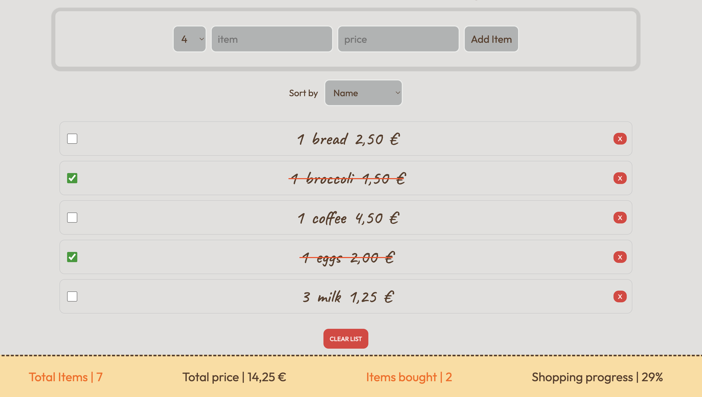
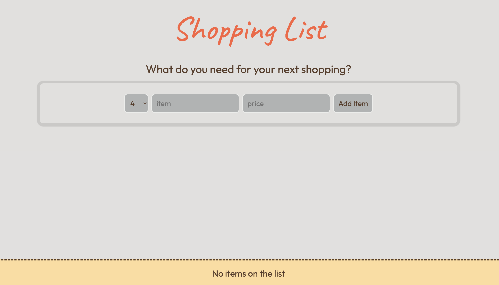

# React Shopping List

[https://shopping-list-jose.netlify.app/](https://shopping-list-jose.netlify.app/)

This project is a practical, hands-on application developed using React. It's a simple yet robust shopping list app that allows users to keep track of their shopping items.

Interacting with the app.

## Main Features

- **Add Items:** Users can add items to their shopping list, including the name, quantity and price.

- **Delete Items:**  This feature helps in managing items efficiently, especially removing items that have already been bought or are no longer needed. Users have the option to clear out all items from the list at once.

- **Check Off Items:** Users can mark items as purchased. This feature helps in tracking which items have already been bought without removing them from the list.

- **Persistent Storage:** The application uses local storage to save items. This feature ensures that the user's list is accessible even after closing the app or rebooting the system.

- **Price Tracking:** Each item can have its price, and the app will calculate the total cost of items in the cart. The prices are displayed on the currency based on the default language of the user's browser.

- **Sort Items:** Users can sort items by order added, name, price or if they were bought.

## React Concepts Implemented

- **Components:** The app is built using React functional components with hooks.

- **State Management:** Utilizes React's useState hook for local state management within components, providing a way to add, delete, or edit items on the list.

- **Effect Hook:** The useEffect hook is in play, demonstrating its utility in handling side effects in the app, such as interactions with the local storage.

- **Conditional Rendering:** The app practices conditional rendering methods to display content based on different states.

- **Event Handling:** Incorporated event handlers to manage user inputs, form submissions, and list item actions.
